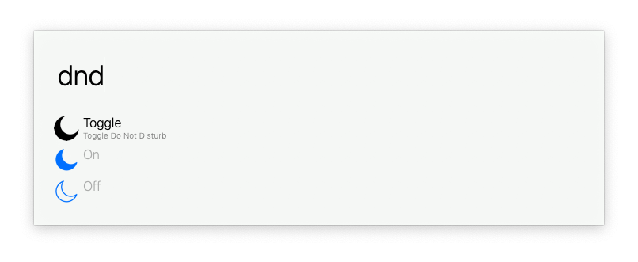

# alfred-do-not-disturb

Simple alfred extension for toggling Do Not Disturb

## Install

Download the workflow from the [latest release](https://github.com/dvcrn/alfred-do-not-disturb/releases/latest/)

## Related

- https://github.com/dvcrn/alfred-darkmode
- https://github.com/dvcrn/alfred-wifi-toggle
- https://github.com/sindresorhus/do-not-disturb
